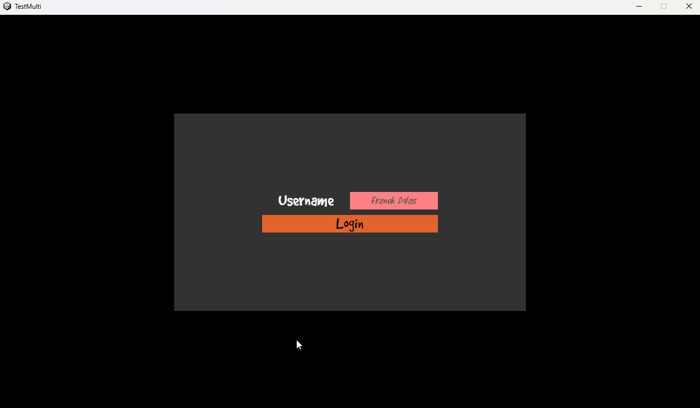
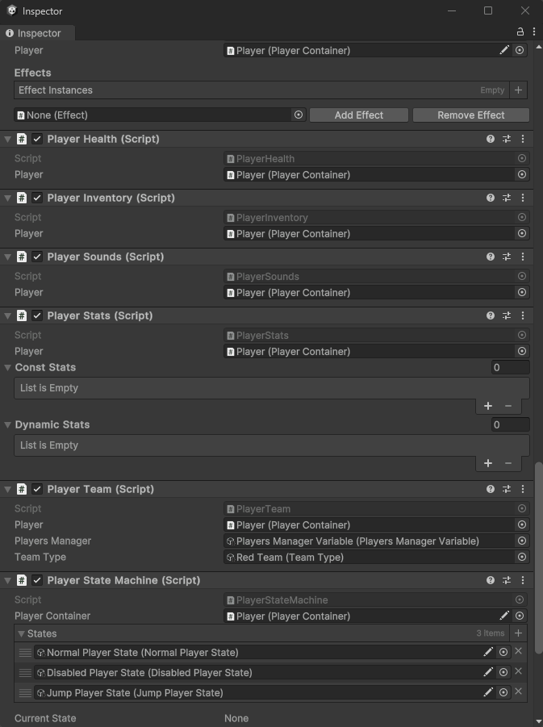

# Unity Test Multiplayer
This is a test Unity project, primary goal of this project is to work out a correct code architecture for a multiplayer game using Component Driven Development and Scriptable Objects Architecture approach.

---

# Used technologies and solutions
1. Scriptable Objects Architecture
2. Netcode for GameObjects
3. Lobby and Relay
4. Odin Inspector (Not included in the project)
5. Component Driven Development
6. Event Driven UI

## Example demonstration of the project

## Component Driven Development in action

## Scriptable Objects Architecture in action
